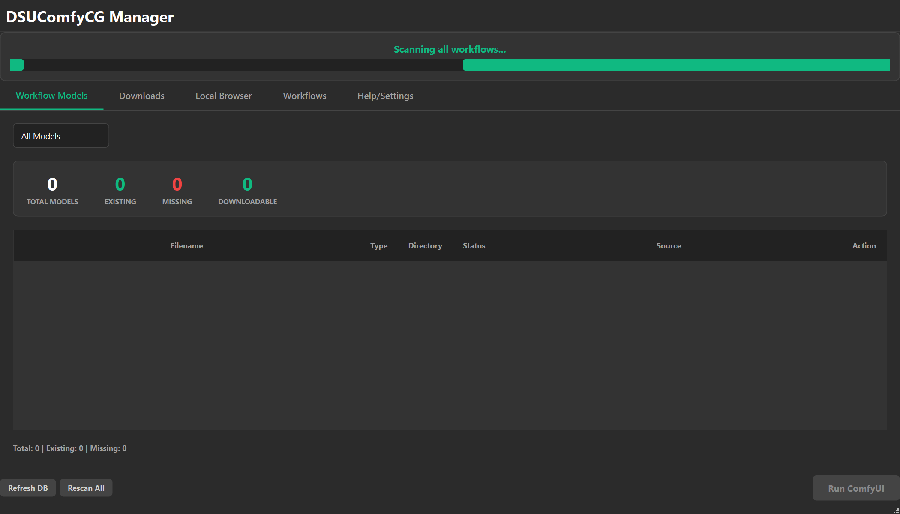

# DSUComfyCG Manager - 사용자 설명서 (v1.2)

 DSUMComfyCG Manager에 새로 통합된 "고급 모델 다운로드 및 Tabular UI"의 사용 설명서입니다. 이번 업데이트로 복잡한 다중 패널을 걷어내고, 워크플로우에 필요한 노드와 모델을 **표(Table)** 형태에서 더욱 쉽고 직관적으로 관리할 수 있습니다.

---

## 🚀 1. 원클릭 Tabular "Easy Install" 워크플로우 화면 (새 기능!)
메인 화면의 **[Workflow Models]** 탭이 직관적인 표(Table) 구조로 전면 개편되었습니다.

1. **상단 요약 배너 (Summary Banner):** 전체 모델 수(`TOTAL MODELS`), 설치된 모델(`EXISTING`), 누락된 모델(`MISSING`), 다운로드 가능한 모델(`DOWNLOADABLE`) 상태를 한눈에 보여주는 컬러 카운터가 최상단에 배치되어 있습니다.
2. **6열(Column) 모델 리스트:** 해당 워크플로우를 실행하기 위해 필요한 커스텀 노드와 모델 목록이 표 형태로 나타납니다. `Status`와 `Source` 열을 통해 현재 설치 여부와 다운로드 출처를 파악할 수 있습니다.
3. **인라인 1-Click 다운로드 (Action 열):** 우측 끝 'Action' 열에 있는 노란색 **[Download]** 버튼을 클릭하면 귀찮은 클릭이나 이동 없이 곧바로 백그라운드 다운로드가 시작됩니다. 진행률은 표 하단 막대 바에서 표시됩니다.

---

## ✨ 2. 수동 소스 입력 및 고급 검색 (Manual URL URL & Tavily)
모델의 출처를 알 수 없어(`Manual URL` 표기) 직접 다운로드할 수 없을 때는 사용자가 직접 링크를 입력하거나 AI 검색 엔진을 켤 수 있습니다.

1. 표에서 노란색 **[Manual URL]** 버튼을 클릭합니다.
2. 링크 입력 및 검색 창 다이얼로그가 열립니다. 직접 알고 있는 다운로드 URL 링크(예: HuggingFace, CivitAI 주소)를 붙여넣습니다.
3. 소스를 모른다면 다이얼로그 내의 **`✨ Advanced Search (Tavily)`** 버튼을 클릭하여 AI 엔진이 인터넷에서 찾아주는 모델 링크를 사용합니다.
4. 검색 결과를 **더블 클릭**하고 **`[저장]`** 버튼을 누릅니다.
5. URL이 로컬 모델 DB(`models_db.json`)에 영구 저장되며, 동시에 곧바로 모델 다운로드가 백그라운드에서 시작됩니다. 앞으로 동일한 모델이 필요할 때는 자동으로 1-Click 다운로드 버튼이 활성화됩니다!

---

## 📦 4. 로컬 모델 브라우저 (Local Models Tab)
현재 PC에 설치된 모든 모델을 직관적으로 탐색할 수 있습니다.

- **[📦 로컬 모델]** 탭으로 이동합니다.
- **폴더 트리:** 좌측에서 `checkpoints`, `loras`, `controlnet` 등 카테고리별로 설치된 모델을 볼 수 있습니다.
- **용량 및 관리:** 파일을 클릭해 용량을 확인하고 쓸데없는 모델은 지울 수 있습니다.
- **미사용 모델 식별 (`unused` 패턴 매칭):** 워크플로우 리스트에 있는 그 어떤 JSON에서도 단 한 번도 쓰이지 않은 모델을 색상(빨간 텍스트)과 태그로 구분해줍니다. 용량 정리에 유용합니다.

---

## ⚙️ 5. 설정 탭 (Settings Tab)
검색 엔진과 다운로더의 세부 설정을 변경합니다.

- **[⚙️ 설정]** 탭에 들어갑니다.
- **API Keys:** HuggingFace 토큰, CivitAI API Key, Tavily API Key를 입력하여 검색 품질과 속도를 대폭 비약적으로 향상시킬 수 있습니다. *(API Key 없이도 기본 검색은 모두 작동합니다)*
- **병렬 다운로드 (aria2):** 지원 환경일 경우 매우 빠른 분할 다운로드를 지원합니다.
- **캐시 초기화:** 검색 기록이나 잘못 매칭된 로컬 데이터를 지울 때 사용합니다. `사용되지 않는 모델 캐시 초기화` 버튼으로 언제든 시스템을 깔끔하게 유지하세요.
